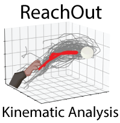

# ReachOut platform

The following project describes the design, fabrication, assembly and use case of the open-source hardware platform for mice reach-to-grasp task training and fine motor skill video analysis. We present the behavioral platform - automated mouse Reaching Box that was designed to be 3D printed and hence easily reproducible. The device is used to train animals to perform reach-to-grasp dexterity task: approach the proximal part of the reaching box and reach for single sugar pellets disposed by motorized feeder disk located in front of the narrow slit. 
This task is used for studying planning and execution of fine motor skills requiring cortical control of the forepaw and finger movement. Behavioral apparatus allows to record the video and track the forepaw and fingers during the reaching movement. Tracking data (performed by DLC networks) can be analyzed further to extract different kinematic parameters (speed, acceleration, jerk, accuracy) and different moments of the reach (start, peak, end) to use them as behavioral keypoints (ex. peri-event analysis).

This repository is accompanying the STARs protocol article describing the fabrication and use of the setup

[Open-source platform for kinematic analysis of mouse forelimb movement](https://star-protocols.cell.com/protocols/3539)

For even more details on installation and use of the Software/Hardware platform visit the 
[Docs Website]

 

[![berezhnoyd.github.io]][Docs Website]

 

The website contains all the documentation and repository contains all the materials to build the mouse reaching task and analyze the data acquired with this task
- *Schematics and blueprints* to assemble the components 
	(**/Article Supplements/**)
- *3D models* for the components of the box 
	(**/ReachingBox_3D_Model/**)
- *Scripts to run the video recording* from the FLIR Camera and logging the data from Arduino 
	(**/Recording toolbox/**)
- *Scripts for the full analysis* dataflow: detecting body parts with DLC and getting the reaching trajectories 
	(**/Analysis toolbox/**)

___

## Installation
***ReachOut*** pipeline can be used with the **behavioral box** to analyze reaching kinematics or as a **standalone application** for kinematic
analysis for the action of your choice (walking, whisker movement, you name it) with certain adaptations. In both cases you
will need to install some software components on your recording/analysis computer. We split the scripts used to two toolboxes with different purpose.

### Recording toolbox
The recording toolbox contains two parts: 
- one on the **Arduino** side (Choose one script from */Arduino/* folder of the repository and uploaded to the microcontroller with the use of **Arduino IDE**). 
- and one on the **PC** side. This Python CLI program is used to record simultaneously from the FLIR camera and from Arduino. 
There are two different programs that can be copies from */FLIR_CPU/* folder of the repository. This part is taken with minor changes from the [PySpin repository], so you should follow the additional instructions listed there. 
We also provide installation instructions on our [Docs Website].

### Analysis toolbox
All the code for analysis toolbox is compiled in the /2D pipeline/ folder. To run different steps of the analysis just run
one of the *ReachOut Notebooks* [^1].
Analysis toolbox is dependent on different Python libraries (ex. DEEPLABCUT, ANIPOSE) and Jupyter Notebook [^2].
DEEPLABCUT (https://github.com/DeepLabCut/DeepLabCut)
ANIPOSE (https://github.com/lambdaloop/anipose)

To make it easier for installation all the dependencies are included in the included **DEEPLABCUT.yml** conda environment file [^3].

___

[^1]: Small library of classes and functions needed to run the kinematic analysis is contained in the *.py files in the same directory and you imported in Notebooks themselves.
[^2]: If you just want to use the Analysis and Visualization notebook on your analyzed videos it should work even in the base Anaconda environment without DLC/Anipose installed. 
[^3]: There are known copmatibility problems on some PCs with the installation of new DLC version that we are trying to fix. Please contact us with any problems you experience.
___
### Troubleshooting

Feel free to read our [Docs Website] and if you still have questions submit a request here or contact the developer directly. 
Contribute, star this repository if you use it and submit an issue for any questions. Let's make it better together.

___

[Docs Website]: https://berezhnoyd.github.io/Reaching_Task_VAI/
[PySpin repository]: https://github.com/neurojak/pySpinCapture
[berezhnoyd.github.io]: https://img.shields.io/badge/Visit_berezhnoyd.github.io-37a779?style=for-the-badge
